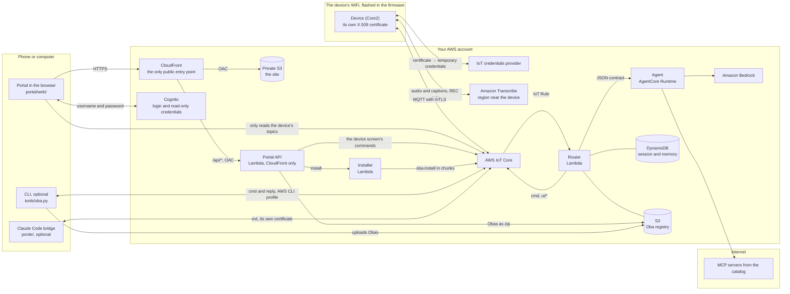

# Oba Pocket

**English** · [Português](README.md)

<p align="center"></p>

Obas are AI agents with a body. The body lives on an M5Stack Core2: an animated face,
a speech bubble, touch, sensors, LEDs and vibration. The brain is the harness, which
runs outside the device. The two talk over MQTT, using the [Oba Protocol v1](docs/protocol.md).

Each Oba is a folder with an `oba.json` that says what it looks like, how it reacts on
its own and which agent is its brain ([how to make an Oba](docs/oba.md)). The microSD
card is the Oba library. Without a card, the device uses the built-in Oba, Nimbo
(`obas/nimbo`).

> **Personal project.** Oba Pocket is a personal, non-profit project with no ties to
> any company. It isn't a product and isn't supported or endorsed by AWS, Anthropic,
> M5Stack or any other company. The names and trademarks mentioned belong to their
> owners.

The code comments, the docs in `docs/` and the device UI are in Brazilian Portuguese.

## What it does

- **Reacts instantly, no cloud needed:** touches, shakes, taps and loud noises turn
  into moods, sounds, LEDs and vibration, following the Oba's reflex table.
- **Follows a meeting:** with REC on, audio goes straight from the device to Amazon
  Transcribe. The agent reads the captions and answers with a bubble right away or with
  an "ace up its sleeve": a rule that fires on the device when someone brings the topic
  back up. When REC turns off, the summary shows up on the portal.
- **Answers to its name:** with REC on, saying the Oba's name makes it react right
  away and publishes a `wake` event. The agent only wakes up on it if the Oba has
  `{"on": "wake"}` in `agent.triggers`.
- **Swaps Obas over the air:** the portal (or `tools/oba.py install`) sends an Oba over
  MQTT; the device checks each file's sha256 and asks on screen before installing.
- **Portal on your phone:** a site with a login shows the captions, the cards and the
  summary, the device's state and the Obas in the registry, with a preview. It also
  takes a new Oba as a zip and removes Obas from the registry. No computer needed.
- **Approves Claude Code from the device:** the [Claude Code bridge](docs/ponte.md)
  shows on the Oba when Claude is working or waiting for you, and brings permission
  requests to the screen. Approving or denying is a tap; a dangerous request asks you
  to hold the button.
- **Two kinds of body:** vector (rig), like Nimbo, or PNG pixel art with WAV sounds,
  like Bit (`obas/bit`).

<p align="center"></p>

## Architecture



The [full diagram](docs/arquitetura.png) also shows the policies, the ports and what
runs on each of the device's cores. You can edit it in draw.io:
[`docs/arquitetura.drawio`](docs/arquitetura.drawio).

- **Device** (`src/`): keeps the active Oba in PSRAM, draws at 30 frames per second,
  runs the reflexes and publishes high-level events (`touch.tap`, `imu.shake`, `wake`,
  captions). It never publishes raw sensor streams over MQTT; audio, with REC on, goes
  straight to Transcribe.
- **Router** (`harness/router/`): applies the active Oba's triggers (batching, debounce,
  cooldown), keeps the session in DynamoDB, fetches the `oba.json` from the S3 registry
  and publishes the agent's actions.
- **Agent** (`harness/agent/`): a generic [Strands](https://strandsagents.com) agent on
  Amazon Bedrock AgentCore, built from the `agent` block of the `oba.json` (persona,
  model, abilities, MCP servers from an allow list). Any agent that follows the
  [contract](docs/protocol.md#contrato-roteador--agente) can be an Oba's brain.
- **Portal** (`portal/`): a site on CloudFront, with a Cognito login, built for the
  phone. The Meeting tab shows the captions, the cards and the summary. The Device tab
  shows the state and sends the commands the device's screen offers: activate, remove,
  play a sound and turn REC off. The Obas tab lists the registry with previews, installs
  on the device and removes from the registry, and the Upload tab takes a new Oba as a
  zip. The browser only reads the device's topics; everything else goes through the API
  (`portal/api/`). Details in [Portal](#portal).
- **CLI** (`tools/oba.py`): does the same from the command line, with the AWS CLI
  profile and without the portal's 4 MB limit.
- **Bridge** (`ponte/`): a Claude Code plugin and a daemon on that machine, which talk
  straight to IoT Core as an [external source](docs/protocol.md#fontes-externas-ext),
  with one certificate per machine. Details in [docs/ponte.md](docs/ponte.md).

Almost everything lives in the `region` from `config.json`. Transcribe runs in
`transcribe.region`, close to the device. Bedrock uses an inference profile, which
spreads the calls across its own regions; `model_regions` has to cover them, since it's
the list the agent's policy allows.

### Why the cloud

Oba Pocket is meant to go with you. Wherever the device has internet, it talks straight
to AWS and the Oba works without any server of yours running. The portal is a static
site on CloudFront, and its API is a Lambda that only runs when someone uses it.

- **Each device has its own identity.** `setup.py` creates the key and a CSR on your
  machine, and IoT Core issues the certificate. The key lives in `src/secrets.h`
  (git-ignored) and in the device's flash, unencrypted
  ([Lost the board?](#lost-the-board)), and never goes to AWS. With the certificate, the
  device opens MQTT (mTLS) and trades the same certificate for temporary credentials
  that only work for Transcribe. The policy only lets the device publish on its own
  topics, under `<prefix>/<device>/` (`state`, `evt`, `transcript`, `reply` and
  `ext/<source>/re`), and receive only `cmd` and the `ext/<source>` of the
  [external sources](docs/protocol.md#fontes-externas-ext).
- **Audio doesn't go through the harness.** It goes from the device to Transcribe, and
  the text comes back to the device. Only the final sentences on the `transcript` topic
  go on to the router, through the IoT Rule. The `wake` and `rule.fired` events carry
  the sentence where the name or the word showed up, sometimes still partial.
- **State doesn't live in the Lambda.** The session, the armed rules and the memory are
  in DynamoDB, and the Obas are in S3. The Lambda only keeps a short cache of the
  `oba.json`.
- **The brain is replaceable.** An Oba picks its agent by name from the `agents` catalog
  in `config.json`. It can be another AgentCore runtime
  (`{"type": "agentcore", "arn": "…"}`), which runs agents from any framework (Strands,
  LangGraph, LangChain…) as long as they follow the
  [contract](docs/protocol.md#contrato-roteador--agente), or a URL
  (`{"type": "http", "url": "…"}`) that gets the same JSON in a POST. `setup.py` only
  lets the router call the runtimes in the catalog. The catalog's MCP servers are
  outside your account; the agent calls them over the internet.

> **The `http` agent has no authentication.** The router doesn't send any: whoever has
> the URL can call the agent and use your Bedrock on your bill. Use it for development
> only, and don't expose the agent through a public tunnel. Outside localhost
> (`localhost`, `127.0.0.1`, `::1`), the URL has to be `https`: `setup.py` and the
> router reject anything else.

The device knows a single WiFi network, the one in `src/secrets.h`, and switching
networks means flashing it again. It only connects on 2.4 GHz and can't get past captive
portals or WPA2-Enterprise, and the network has to allow outgoing traffic on ports 8883
(MQTT), 8443 (Transcribe) and 443, plus NTP. Away from home, a phone hotspot does the
job: turn on its compatibility mode (or the 2.4 GHz band).

| | In the cloud (today) | Local |
|---|---|---|
| Where it works | wherever the device has internet, through the network flashed on it (or a hotspot) | only on the harness's network, or over a VPN |
| What has to stay on | no server of yours; the portal is a static site and Lambdas that only run when used | a machine with the broker, the router and the agent |
| Security | mTLS per device, per-topic policy, temporary credentials. The portal requires a login, and only CloudFront answers the internet ([Portal](#portal)) | up to you: TLS and users on the broker |
| Cost | pay per use, no monthly fee: Transcribe minutes, Bedrock tokens, AgentCore, Lambda, IoT Core, DynamoDB, S3, CloudFront, Cognito and CloudWatch Logs (S3 and log storage bills even when idle) | the machine; no cloud bill if speech and the model are local too |
| Agent on your network | no: the Lambda can't see your network, and the `http` agent has no authentication to sit behind a public tunnel | directly, on localhost |
| Audio and captions | go through your AWS account | stay on your network, if speech and the model are local too |

Before you try it, create a budget in AWS Budgets with an alert, so you know early if
spending goes past what you expect.

`setup.py` doesn't delete anything. To stop paying, delete the resources by hand: almost
all of them have the `prefix` in their name (with `_` instead of `-` in the IoT Rule,
the AgentCore runtime and the identity pool), and the device's thing is named after
`device`. The user pool is created with deletion protection on (turn it off first), the
CloudFront distribution has to be disabled before it can be deleted, and the registry
bucket keeps versions.

### Portal

From your account, only CloudFront answers the internet. AWS's own endpoints (the
Cognito login and IoT Core, which the device already uses) are the usual ones.

- **Login:** username and password in Cognito, on its own login page, in Portuguese.
  `setup.py` creates the accounts listed in `portal.users` in `config.json`, but taking
  someone off the list doesn't delete their account (see below how to cut someone off).
  Five wrong passwords in a row lock the user out for a growing amount of time.
- **Nothing is exposed:** the site's bucket is private, and the API is a Function URL
  with IAM auth. Both only accept requests signed by the distribution (OAC). There's no
  S3 website, API Gateway, load balancer or open security group.
- **The API checks the Cognito token on every request**, by its signature. It goes in
  `x-oba-token`, because OAC takes over `Authorization`. The API only accepts the
  commands the device's screen offers; turning REC on is still only possible from the
  device's button.
- **The browser only reads.** The identity pool credentials last 1 h and renew by
  themselves. They open MQTT over WebSocket and can only subscribe to
  `<prefix>/<device>/*`. The API attaches the IoT policy on each login: with
  `iot:AttachPolicy`, the browser could attach any policy to itself.
- **Obas as zip:** up to 4 MB. The API checks the zip like `tools/oba.py validate` and
  rejects symlinks, `..` and zip bombs before uploading to the registry. To install,
  another Lambda (the installer) sends the Oba in chunks to the device, which asks for a
  tap on "Instalar".
- **Strict CSP:** no third-party scripts and no inline code; the libraries live in
  `portal/web/vendor/`. The refresh token stays in the browser for up to 7 days: the
  portal session lasts that long without asking you to log in again, and "Sair"
  (sign out) revokes it.

Whoever gets into the portal sees the captions and the summary, sends the device
screen's commands, and uploads, installs and deletes Obas in the registry. Only give
access to people who may do that.

To cut someone off, disable the user and do a global sign-out. `<pool>` is the id of
the `<prefix>-portal` user pool:

```sh
aws cognito-idp admin-disable-user --user-pool-id <pool> --username <user>
aws cognito-idp admin-user-global-sign-out --user-pool-id <pool> --username <user>
```

The cut isn't instant. The API checks the token by its signature, without asking
Cognito, so a token that's already out keeps working until it expires, within 60 min.
The MQTT read credentials the browser already has also last up to 1 h. After that, the
person can't log in or renew the session. To delete the account, use
`admin-delete-user` and take the user out of `portal.users`: otherwise the next
`setup.py` creates the account again.

### Running it locally

The protocol doesn't depend on AWS and, in the firmware, all the networking (MQTT,
credentials and the Transcribe stream) is in `src/cloud.cpp`. The harness, the portal
and the CLI use AWS services. To run everything on a local network, this would have to
change:

- **Broker:** an MQTT broker (Mosquitto, for example) instead of IoT Core. In the
  firmware, `src/cloud.cpp` would read the host, port and credentials (username and
  password, or TLS certificates) from the configuration, instead of the IoT Core
  endpoint.
- **Speech:** Transcribe can stay, because the credentials provider is a separate HTTPS
  call, with the same certificate, and doesn't depend on the MQTT connection; the thing,
  the policy and the role alias from `setup.py` stay. With no AWS at all, the stream in
  `src/cloud.cpp` (`startStream`, `pumpAudio`, `onWsEvent`, `handleTranscript`) would
  have to send the audio to a local speech recognizer (Whisper, for example), and the
  device would keep publishing the sentences on `transcript`.
- **Router:** a process with `paho-mqtt` instead of the IoT Rule and the Lambda. It
  would subscribe to `<prefix>/+/+`, do what the rule does (add `dev` and `ch`, the 2nd
  and 3rd topic levels, to the JSON) and call the `handler` in
  `harness/router/router.py` on a thread per message, with a `context` that has
  `get_remaining_time_in_millis()`, since the handler waits for the debounce and the
  agent. The router publishes through `iot-data`, keeps the session in DynamoDB and
  reads the registry from S3: those become the broker, SQLite and a folder.
- **Agent:** `harness/agent/main.py` already runs outside AgentCore. `python main.py`
  serves `/invocations` on `127.0.0.1:8080`; to change the port, use
  `app.run(port=8081, host="127.0.0.1")`. Keep it on `127.0.0.1`: the agent has no
  authentication, and whoever reaches it uses your Bedrock. In the catalog, with the
  router on the same machine, it goes in as
  `{"type": "http", "url": "http://localhost:8080/invocations"}`.
  With no AWS, the model moves from Bedrock to another Strands provider (a local model,
  for example).
- **Portal and CLI:** `portal/web/` would connect to the broker's WebSocket, and the
  API (`portal/api/`) would become a process on the network, with another login instead
  of Cognito. `tools/oba.py` would publish through the broker and write the Obas to the
  registry folder, instead of using IoT Core and S3.

## Requirements

- An M5Stack Core2 for AWS (EduKit). A microSD card is optional: if it isn't FAT32,
  the device offers to format it (hold to confirm).
- A 2.4 GHz WiFi network (or a phone hotspot in compatibility mode).
- An AWS account with an AWS CLI profile that can create the resources, and Bedrock
  access to the model in `config.json`.
- [PlatformIO Core](https://platformio.org), Python 3.10 or newer, `openssl`, and
  [uv](https://docs.astral.sh/uv/) (or pip) to package the harness.

## Getting started

```sh
cp config.example.json config.json            # prefix, device, regions, models, portal users
python3 -m venv .venv && . .venv/bin/activate
pip install boto3 jsonschema paho-mqtt pyserial pillow
python3 setup.py                              # AWS: device, harness and portal, least privilege
# fill in WIFI_SSID and WIFI_PASS in src/secrets.h (2.4 GHz network; setup tells you if they're missing)

pio run -e core2foraws -t upload              # firmware
```

`setup.py` uses the default AWS CLI profile (or `AWS_PROFILE`) and is safe to run again
as many times as you like: it only changes what changed. It creates the thing and its
certificate, the policies, the Transcribe role alias, the custom vocabulary, the S3
registry, the table, the Lambda, the router's IoT Rule, the AgentCore runtime and the
portal (bucket, CloudFront, Cognito, the API and the installer), and at the end it prints
the portal's address. It also writes `src/aws_config.h` and `src/secrets.h`. The device's
private key is created on your machine and never goes to AWS.

On the portal:

- **Users:** add each one to `portal.users` (`{"username": "…", "email": "…"}`) and run
  `python3 setup.py --portal`, which only touches the portal. A new user gets a
  temporary password by email, valid for 3 days. On the first login, Cognito asks for a
  new password: 12 characters or more, with upper and lower case, a number and a symbol.
  If the temporary one expires, `python3 setup.py --resend <user>` sends another.
- **Your own domain:** `portal.domain` with `portal.cert_arn` (an ACM certificate in
  us-east-1). Without them, the address is the distribution's `*.cloudfront.net`, which
  still accepts TLS 1.0; with them, CloudFront requires TLS 1.2 or newer.
- **On the phone:** "Add to Home Screen" opens the portal like an app.

On the agent:

- **MCP servers:** `mcp` in `config.json` holds the URLs of the MCP catalog.
  `aws-knowledge` is the AWS documentation. `demos` is optional (`null` leaves it out):
  the URL of an MCP server of yours that returns demos with a link (`url` over https and
  `title`). The agent uses that catalog to suggest `demo` cards on Obas that ask for
  `demos` in `agent.mcp`. For the link to become a QR code, its domain has to be in
  `url_hosts`.
- **`DEMOS_MCP_TOKEN`:** if the `demos` server needs authentication, export this
  variable before running `setup.py`. The value goes as is in the `Authorization`
  header (for example, `Bearer …`). The token goes into an environment variable of the
  AgentCore runtime, in plain text: anyone who can read the runtime's configuration in
  the account sees it.

On the device:

- **REC** (top left corner): turns transcription on and off. Only the button turns the
  microphone on; the agent can turn it off, never on.
- **Middle button:** opens the Oba picker (with REC off). Tap to choose, hold to remove.
- **Touch the Oba:** petting. Shaking, tapping and loud noises count too.

## Making an Oba

```sh
mkdir -p obas/my-oba && $EDITOR obas/my-oba/oba.json
python3 tools/oba.py validate obas/my-oba              # checks what the device checks
python3 tools/oba.py install obas/my-oba --activate    # sends it over the air and activates it
```

The [guide](docs/oba.md) covers every field: look (rig or sprites), moods, reflexes,
sounds, wake words, requested capabilities and the brain (`agent`). The format is in
[`schema/oba.schema.json`](schema/oba.schema.json). Nimbo and Bit are working examples;
`obas/bit/draw.py` generates Bit's frames and sounds.

Obas you don't want to publish can live in `obas.private/`: git ignores that folder,
and `setup.py` uploads the Obas in it to the registry too.

From the portal, zip the Oba's folder, with `oba.json` at the root of the zip or inside a
single folder, and send it on the Upload tab. The portal checks the Oba, uploads it to
the registry and offers to install it. Watch out: `setup.py` uploads the Obas from the
`obas` folders in `config.json` again, so an Oba sent through the portal with the same
id goes back to the repository's version.

## Protocol

The [Oba Protocol v1](docs/protocol.md) uses eight topics under `<prefix>/<device>/`:
`state` (retained), `evt`, `transcript` and `reply` from the device, `cmd` and
`ui/<channel>` from the harness, and `ext/<source>` and `ext/<source>/re`, between the
device and external sources such as the Claude Code bridge. The document covers the
envelope, every event and command (`speak`, `arm`, `react`, `look`, `vibrate`, `leds`,
`play`, `read`, `oba.install`…), the triggers, the session, the router → agent
contract, the external sources and the minimal IAM policy for the CLI.

## Folders

| Folder | |
|---|---|
| `src/` | firmware (PlatformIO, Arduino) |
| `harness/router/` | router: Oba triggers, session, armed rules |
| `harness/agent/` | generic agent (Strands) and its abilities (`abilities/`) |
| `obas/` | public Obas: Nimbo and Bit |
| `schema/` | `oba.json` format |
| `portal/` | portal: the site (`web/`), the API and the installer (`api/`) |
| `ponte/` | Claude Code bridge: the marketplace and the `oba-ponte` plugin ([docs/ponte.md](docs/ponte.md)) |
| `docs/` | protocol, Oba guide, Claude Code bridge and the architecture diagram |
| `tools/` | serial monitor, Oba validation and install, fonts and icons |

## Tools

- `tools/oba.py validate <folder>`: checks an Oba against the schema, the sha256
  hashes and the limits.
- `tools/oba.py install <folder> [--activate]`: installs an Oba on the device over the
  air (MQTT) and, after you tap "Instalar" on its screen, uploads it to the S3 registry
  (`--no-registry` leaves the registry alone). The other cloud commands:
  `remove <id> [--registry]`, `activate <id>`, `play <sound> [--volume N]`,
  `list [--registry]` and `publish <folder>` (registry only). They all use the device
  from `config.json` (`--device` picks another one) and the AWS CLI profile, with the
  [minimal policy](docs/protocol.md#policy-iam-mínima-da-cli).
- `python3 setup.py --ponte <name>`: creates the source for a
  [Claude Code bridge](docs/ponte.md) (thing, certificate and policy) and writes it all
  to `build/ponte-<name>/`. With `--new-cert`, it replaces that bridge's certificate.
- `python3 setup.py --new-cert`: runs the setup and replaces the device's certificate,
  deactivating the old one ([Lost the board?](#lost-the-board)).
- `tools/monitor.py`: serial log, screenshots (`s`) and Obas over serial
  (`u <folder>`, `a <id>`, `l`, `o`). REC (`r`) and simulated speech (`t <phrase>`) only
  with the dev firmware, which has the test commands: `pio run -e dev -t upload`. It
  finds the device on USB by itself.
- `tools/svg_to_outline.py`: turns an SVG into the outline of a rig Oba.
- `tools/make_font.py`: builds the bubble font from Nunito.
- `tools/fetch_icons.py [--url <zip>]`: downloads the AWS icons for the router
  (`setup.py` calls it when they're missing; they're not in the repo). If the download
  fails, setup goes on without icons, and the bubble shows up without the service icon.
  To get the icons, grab the link to the new zip at
  https://aws.amazon.com/architecture/icons/, run it with `--url` and then `setup.py`.

## Secrets

`src/secrets.h` (WiFi, the device's certificate and key), `src/aws_config.h` and
`config.json` are generated or filled in by you and stay out of git. So do
`src/secrets.h.bak`, which a certificate swap leaves behind with the old key, and each
bridge's `build/ponte-<name>/`, with `cert.pem` and the private key (`key.pem`): the
whole `build/` folder is ignored. The portal's `config.js` isn't a secret, since it goes
to the browser, but it carries your account's ids. That's why it's created in
`build/portal/` and goes straight to the bucket. Nothing in the repo depends on a
specific account.

## Lost the board?

The certificate, the key and the WiFi password live in the device's flash, unencrypted.
Whoever has it and a USB cable can read all of it and pass as the device: publish on its
topics, which wake the agent, and get Transcribe credentials, which cost you money. So:

1. On the machine with `src/secrets.h`, run `python3 setup.py --new-cert`. In the same
   run, it creates a new certificate and deactivates the old one. The old device stays
   offline until it's flashed again over USB; the Transcribe credentials it already had
   last up to 1 h.
2. Change the password of the WiFi network that was flashed on it, and put the new one
   in `WIFI_PASS`, in `src/secrets.h`.
3. Flash the firmware again (`pio run -e core2foraws -t upload`) on the new device, or on
   the old one, if it comes back.

`src/secrets.h.bak` keeps the old key. It stays out of git, but you can delete it. For a
machine with the bridge, see [docs/ponte.md](docs/ponte.md#desinstalar).

## Security

How to report a vulnerability, and who can read and command the device, is in
[SECURITY.md](SECURITY.md).

## License

Oba Pocket is a personal, non-profit project with no ties to any company. It isn't a
product and isn't supported or endorsed by AWS, Anthropic, M5Stack or any other
company. The names and trademarks mentioned belong to their owners.

The code is under the [MIT license](LICENSE).

- **Firmware:** uses M5Unified and M5GFX, ArduinoJson and PubSubClient (MIT), Adafruit
  NeoPixel (LGPL-3.0), arduinoWebSockets (LGPL-2.1) and the Arduino-ESP32 core
  (LGPL-2.1, on top of ESP-IDF, Apache-2.0). PlatformIO downloads the libraries at build
  time; they're not in the repo. Whoever distributes the compiled firmware follows their
  licenses.
- **Font:** Nunito (`tools/fonts/` and the generated font in `src/bubble_fonts.cpp`) is
  under the [SIL Open Font License 1.1](tools/fonts/Nunito-OFL.txt).
- **Portal:** MQTT.js and qrcode-generator, in `portal/web/vendor/`, are MIT.
  `mqtt.min.js` bundles MIT, ISC, BSD-3-Clause and Apache-2.0 packages.
  `portal/web/vendor/LICENSES.txt` lists each one, with its license text.
- **AWS icons:** the icon package the router shows on the device isn't in the repo:
  `tools/fetch_icons.py` downloads the official one, which has its own terms. The
  diagram in `docs/` uses the AWS Architecture Icons the way AWS allows in architecture
  diagrams.
