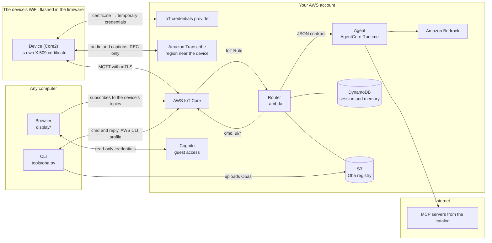

# Oba Pocket

**English** · [Português](README.md)

<p align="center"></p>

Obas are AI agents with a body. The body lives on an M5Stack Core2: an animated face,
a speech bubble, touch, sensors, LEDs and vibration. The brain is the harness, which
runs outside the device. The two talk over MQTT, using the [Oba Protocol v1](docs/protocol.md).

Each Oba is a folder with an `oba.json` that says what it looks like, how it reacts on
its own and which agent is its brain ([how to make an Oba](docs/oba.md)). The microSD
card is the Oba library. Without a card, the device uses the built-in Oba, Nimbo
(`obas/nimbo`).

The code comments, the docs in `docs/` and the device UI are in Brazilian Portuguese.

## What it does

- **Reacts instantly, no cloud needed:** touches, shakes, taps and loud noises turn
  into moods, sounds and LEDs, following the Oba's reflex table.
- **Follows a meeting:** with REC on, audio goes straight from the device to Amazon
  Transcribe. The agent reads the captions and answers with a bubble right away or with
  an "ace up its sleeve": a rule that fires on the device when someone brings the topic
  back up. When REC turns off, the summary shows up on the separate display.
- **Answers to its name:** with REC on, saying the Oba's name makes it react right
  away and publishes a `wake` event. The agent only wakes up on it if the Oba has
  `{"on": "wake"}` in `agent.triggers`.
- **Swaps Obas over the air:** `tools/oba.py install` sends an Oba over MQTT; the device
  checks each file's sha256 and asks on screen before installing.
- **Two kinds of body:** vector (rig), like Nimbo, or PNG pixel art with WAV sounds,
  like Bit (`obas/bit`).

<p align="center"></p>

## Architecture



- **Device** (`src/`): keeps the active Oba in PSRAM, draws at 30 frames per second,
  runs the reflexes and publishes high-level events (`touch.tap`, `imu.shake`, `wake`,
  captions). It never publishes raw sensor streams over MQTT; audio, with REC on, goes
  straight to Transcribe.
- **Router** (`harness/router/`): applies the active Oba's triggers (batching, debounce,
  cooldown), keeps the session in DynamoDB, fetches the `oba.json` from the S3 registry
  and publishes the agent's actions.
- **Agent** (`harness/agent/`): a generic [Strands](https://strandsagents.com) agent on
  Amazon Bedrock AgentCore, built from the `agent` block of the `oba.json` (persona,
  model, abilities, MCP servers from an allow list). Any agent that follows the
  [contract](docs/protocol.md#contrato-roteador--agente) can be an Oba's brain.
- **Separate display** (`display/`): a web page with the captions, the cards and the
  summary. It can only read the device's topics.
- **CLI** (`tools/oba.py`): installs, activates and removes Obas through the cloud, with
  the AWS CLI profile, and uploads Obas to the registry.

Almost everything lives in the `region` from `config.json`. Transcribe runs in
`transcribe.region`, close to the device. Bedrock uses an inference profile, which
spreads the calls across its own regions; `model_regions` has to cover them, since it's
the list the agent's policy allows.

### Why the cloud

Oba Pocket is meant to go with you. Wherever the device has internet, it talks straight
to AWS and the Oba works without any server of yours running. The separate display is
just a static page, opened in a browser.

- **Each device has its own identity.** `setup.py` creates the key and a CSR on your
  machine, and IoT Core issues the certificate. The key lives in `src/secrets.h`
  (git-ignored) and on the device, and never goes to AWS. With the certificate, the
  device opens MQTT (mTLS) and trades the same certificate for temporary credentials
  that only work for Transcribe. The policy only lets the device publish on its own
  topics, under `<prefix>/<device>/`, and receive only `cmd`.
- **Audio doesn't go through the harness.** It goes from the device to Transcribe, and
  the text comes back to the device. Only the final sentences on the `transcript` topic
  go on to the router, through the IoT Rule. The `wake` and `rule.fired` events carry
  the sentence where the name or the word showed up, sometimes still partial.
- **State doesn't live in the Lambda.** The session, the armed rules and the memory are
  in DynamoDB, and the Obas are in S3. The Lambda only keeps a short cache of the
  `oba.json`.
- **The brain is swappable.** An Oba picks its agent by name from the `agents` catalog
  in `config.json`. It can be another AgentCore runtime
  (`{"type": "agentcore", "arn": "…"}`), which runs agents from any framework (Strands,
  LangGraph, LangChain…) as long as they follow the
  [contract](docs/protocol.md#contrato-roteador--agente), or a URL
  (`{"type": "http", "url": "…"}`) that gets the same JSON in a POST. `setup.py` only
  lets the router call the runtimes in the catalog. The URL has to be public, since the
  Lambda can't see your network, and the router doesn't send any authentication yet.
  The catalog's MCP servers are outside your account; the agent calls them over the
  internet.

The device knows a single WiFi network, the one in `src/secrets.h`, and switching
networks means flashing it again. It can't get past captive portals or WPA2-Enterprise,
and the network has to allow outgoing traffic on ports 8883 (MQTT), 8443 (Transcribe)
and 443, plus NTP. Away from home, a phone hotspot does the job.

| | In the cloud (today) | Local |
|---|---|---|
| Where it works | wherever the device has internet, through the network flashed on it (or a hotspot) | only on the harness's network, or over a VPN |
| What has to stay on | no server of yours; the display is a page opened in a browser | a machine with the broker, the router and the agent |
| Security | mTLS per device, per-topic policy, temporary credentials. The display uses Cognito guest access: anyone with `display/config.js` can read the device's captions and summaries, so don't publish the page without authentication | up to you: TLS and users on the broker |
| Cost | pay per use, no monthly fee: Transcribe minutes, Bedrock tokens, AgentCore, Lambda, IoT Core, DynamoDB, S3 and CloudWatch Logs (S3 and log storage bills even when idle) | the machine; no cloud bill if speech and the model are local too |
| Agent on your network | only through a public URL (a tunnel, for example) | directly |
| Audio and captions | go through your AWS account | stay on your network, if speech and the model are local too |

### Running it locally

The protocol doesn't depend on AWS and, in the firmware, all the networking (MQTT,
credentials and the Transcribe stream) is in `src/cloud.cpp`. The harness, the display
and the CLI use AWS services. To run everything on a local network, this would have to
change:

- **Broker:** an MQTT broker (Mosquitto, for example) instead of IoT Core. In the
  firmware, `src/cloud.cpp` would read the host, port and credentials (username and
  password, or TLS certificates) from the configuration, instead of the IoT Core
  endpoint.
- **Speech:** Transcribe can stay, because the credentials provider is a separate HTTPS
  call, with the same certificate, and doesn't depend on the MQTT connection; the thing,
  the policy and the role alias from `setup.py` stay. With no AWS at all, the stream in
  `src/cloud.cpp` (`startStream`, `pumpAudio`, `onWsEvent`, `handleTranscript`) would
  have to send the audio to a local speech recognizer (Whisper, for example), and the
  device would keep publishing the sentences on `transcript`.
- **Router:** a process with `paho-mqtt` instead of the IoT Rule and the Lambda. It
  would subscribe to `<prefix>/+/+`, do what the rule does (add `dev` and `ch`, the 2nd
  and 3rd topic levels, to the JSON) and call the `handler` in
  `harness/router/router.py` on a thread per message, with a `context` that has
  `get_remaining_time_in_millis()`, since the handler waits for the debounce and the
  agent. The router publishes through `iot-data`, keeps the session in DynamoDB and
  reads the registry from S3: those become the broker, SQLite and a folder.
- **Agent:** `harness/agent/main.py` already runs outside AgentCore. `python main.py`
  serves `/invocations` on `127.0.0.1:8080`, the same port as the display in "Getting
  started"; to change the port or accept other machines, use
  `app.run(port=8081, host="0.0.0.0")`. In the catalog, it goes in as
  `{"type": "http", "url": "http://localhost:8081/invocations"}`. With no AWS, the model
  moves from Bedrock to another Strands provider (a local model, for example).
- **Separate display and CLI:** `display/` would connect to the broker's WebSocket,
  without Cognito, and `tools/oba.py` would publish through the broker and write the
  Obas to the registry folder, instead of using IoT Core and S3.

## Requirements

- An M5Stack Core2 for AWS (EduKit). A microSD card is optional: if it isn't FAT32,
  the device offers to format it (hold to confirm).
- An AWS account with an AWS CLI profile that can create the resources, and Bedrock
  access to the model in `config.json`.
- [PlatformIO Core](https://platformio.org), Python 3.10 or newer, `openssl`, and
  [uv](https://docs.astral.sh/uv/) (or pip) to package the harness.

## Getting started

```sh
cp config.example.json config.json            # prefix, device, regions, language, models
python3 -m venv .venv && . .venv/bin/activate
pip install boto3 jsonschema paho-mqtt pyserial pillow
python3 setup.py                              # AWS: device, harness and display, least privilege
# fill in WIFI_SSID and WIFI_PASS in src/secrets.h (setup tells you if they're missing)

pio run -e core2foraws -t upload              # firmware
cd display && python3 -m http.server 8080     # separate display: http://localhost:8080
```

`setup.py` uses the default AWS CLI profile (or `AWS_PROFILE`) and is safe to run again
as many times as you like: it only changes what changed. It creates the thing and its
certificate, the policies, the Transcribe role alias, the custom vocabulary, the S3
registry, the table, the Lambda, the router's IoT Rule, the AgentCore runtime and the display's
Cognito pool. It also writes `src/aws_config.h`, `display/config.js` and
`src/secrets.h`. The device's private key is created on your machine and never goes to
AWS.

On the device:

- **REC** (top left corner): turns transcription on and off. Only the button turns the
  microphone on; the agent can turn it off, never on.
- **Middle button:** opens the Oba picker (with REC off). Tap to choose, hold to remove.
- **Touch the Oba:** petting. Shaking, tapping and loud noises count too.

## Making an Oba

```sh
mkdir -p obas/my-oba && $EDITOR obas/my-oba/oba.json
python3 tools/oba.py validate obas/my-oba              # checks what the device checks
python3 tools/oba.py install obas/my-oba --activate    # sends it over the air and activates it
```

The [guide](docs/oba.md) covers every field: look (rig or sprites), moods, reflexes,
sounds, wake words, requested capabilities and the brain (`agent`). The format is in
[`schema/oba.schema.json`](schema/oba.schema.json). Nimbo and Bit are working examples;
`obas/bit/draw.py` generates Bit's frames and sounds.

Obas you don't want to publish can live in `obas.private/`: git ignores that folder,
and `setup.py` uploads the Obas in it to the registry too.

## Protocol

The [Oba Protocol v1](docs/protocol.md) uses six topics under `<prefix>/<device>/`:
`state` (retained), `evt`, `transcript` and `reply` from the device, and `cmd` and
`ui/<channel>` from the harness. The document covers the envelope, every event and
command (`speak`, `arm`, `react`, `look`, `vibrate`, `leds`, `play`, `read`,
`oba.install`…), the triggers, the session, the router → agent contract and the
minimal IAM policy for the CLI.

## Folders

| Folder | |
|---|---|
| `src/` | firmware (PlatformIO, Arduino) |
| `harness/router/` | router: Oba triggers, session, armed rules |
| `harness/agent/` | generic agent (Strands) and its abilities (`abilities/`) |
| `obas/` | public Obas: Nimbo and Bit |
| `schema/` | `oba.json` format |
| `display/` | separate display in the browser |
| `docs/` | protocol and Oba guide |
| `tools/` | serial monitor, Oba validation and install, fonts and icons |

## Tools

- `tools/oba.py validate <folder>`: checks an Oba against the schema, the sha256
  hashes and the limits.
- `tools/oba.py install <folder> [--activate]`: installs an Oba on the device over the
  air (MQTT) and, after you tap "Instalar" on its screen, uploads it to the S3 registry
  (`--no-registry` leaves the registry alone). The other cloud commands:
  `remove <id> [--registry]`, `activate <id>`, `play <sound> [--volume N]`,
  `list [--registry]` and `publish <folder>` (registry only). They all use the device
  from `config.json` (`--device` picks another one) and the AWS CLI profile, with the
  [minimal policy](docs/protocol.md#policy-iam-mínima-da-cli).
- `tools/monitor.py`: serial log, screenshots (`s`), REC (`r`), simulated speech
  (`t <phrase>`) and Obas over serial (`u <folder>`, `a <id>`, `l`, `o`). It finds the
  device on USB by itself.
- `tools/svg_to_outline.py`: turns an SVG into the outline of a rig Oba.
- `tools/make_font.py`: builds the bubble font from Nunito.
- `tools/fetch_icons.py`: downloads the AWS icons for the router (`setup.py` calls it
  when they're missing; they're not in the repo).

## Secrets

`src/secrets.h` (WiFi, the device's certificate and key), `src/aws_config.h`,
`display/config.js` and `config.json` are generated or filled in by you and stay out
of git. Nothing in the repo depends on a specific account.

## License

The code is under the [MIT license](LICENSE). The Nunito font (`tools/fonts/` and the
generated font in `src/bubble_fonts.cpp`) is under the
[SIL Open Font License 1.1](tools/fonts/Nunito-OFL.txt). The AWS icons aren't in the
repo: `tools/fetch_icons.py` downloads the official package, which has its own terms.
