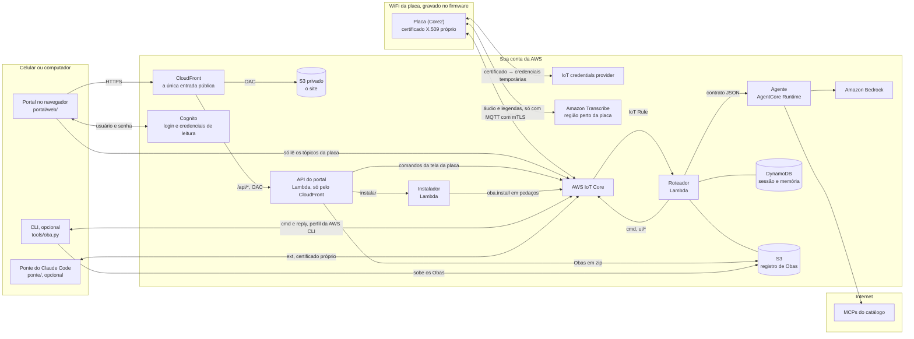

# Oba Pocket

[English](README.en.md) · **Português**

<p align="center"></p>

Obas são agentes de IA com corpo. O corpo mora num M5Stack Core2: rosto animado,
balão de fala, toque, sensores, LEDs e vibração. O cérebro é o harness, que roda fora
da placa. Os dois conversam por MQTT, pelo [Oba Protocol v1](docs/protocol.md).

Cada Oba é uma pasta com um `oba.json`, que diz como ele é, como reage sozinho e qual
agente é o cérebro dele ([como fazer um Oba](docs/oba.md)). O cartão microSD é a
biblioteca de Obas. Sem cartão, a placa usa o Oba embutido, o Nimbo (`obas/nimbo`).

> **Projeto pessoal.** O Oba Pocket é um projeto pessoal, sem fins lucrativos e sem
> vínculo com nenhuma empresa. Não é um produto e não tem apoio nem endosso da AWS, da
> Anthropic, da M5Stack ou de qualquer outra empresa. Os nomes e as marcas citados
> pertencem aos donos.

## O que ele faz

- **Reage na hora, sem nuvem:** toque, chacoalhão, batidinha e barulho viram humores,
  sons, LEDs e vibração, pela tabela de reflexos do Oba.
- **Acompanha uma reunião:** com o REC ligado, o áudio vai direto da placa para o
  Amazon Transcribe. O agente lê as legendas e responde com um balão na hora ou com
  uma "carta na manga", uma regra que dispara na placa quando alguém volta ao assunto.
  Quando o REC desliga, o resumo aparece no portal.
- **Atende pelo nome:** com o REC ligado, falar o nome do Oba faz ele reagir na hora e
  publica o evento `wake`. O agente só acorda com isso se o Oba tiver `{"on": "wake"}`
  em `agent.triggers`.
- **Troca de Oba pelo ar:** o portal (ou o `tools/oba.py install`) manda um Oba pelo
  MQTT, e a placa confere o sha256 de cada arquivo e pergunta na tela antes de instalar.
- **Portal no celular:** um site com login mostra as legendas, as cartas e o resumo, o
  estado da placa e os Obas do registro, com prévia. Também recebe um Oba novo em zip e
  tira Obas do registro. Não precisa de computador por perto.
- **Aprova o Claude Code pela placa:** a [ponte do Claude Code](docs/ponte.md) mostra no
  Oba quando o Claude está trabalhando ou esperando você, e leva os pedidos de permissão
  para a tela. Aprovar ou negar é um toque; o pedido perigoso pede segurar o botão.
- **Dois tipos de corpo:** vetorial (rig), como o Nimbo, ou pixel art em PNG com sons
  WAV, como o Bit (`obas/bit`).

<p align="center"></p>

## Arquitetura



O [diagrama completo](docs/arquitetura.png) mostra também as policies, as portas e o
que roda em cada núcleo da placa. Dá para editar no draw.io:
[`docs/arquitetura.drawio`](docs/arquitetura.drawio).

- **Placa** (`src/`): mantém o Oba ativo na PSRAM, desenha a 30 quadros por segundo,
  roda os reflexos e publica eventos de alto nível (`touch.tap`, `imu.shake`, `wake`,
  legendas). Nunca publica o fluxo cru dos sensores no MQTT; o áudio, só com o REC,
  vai direto para o Transcribe.
- **Roteador** (`harness/router/`): aplica os gatilhos do Oba ativo (lote, debounce,
  cooldown), guarda a sessão no DynamoDB, busca o `oba.json` no registro S3 e publica
  as ações do agente.
- **Agente** (`harness/agent/`): um agente [Strands](https://strandsagents.com)
  genérico no Amazon Bedrock AgentCore, montado a partir do `agent` do `oba.json`
  (persona, modelo, habilidades, MCPs de uma lista permitida). Qualquer agente que
  siga o [contrato](docs/protocol.md#contrato-roteador--agente) pode ser o cérebro de um Oba.
- **Portal** (`portal/`): um site no CloudFront, com login no Cognito, pensado para o
  celular. A aba Reunião mostra as legendas, as cartas e o resumo. A aba Placa mostra o
  estado e manda os comandos que a tela da placa oferece: ativar, remover, tocar um som e
  desligar o REC. A aba Obas lista o registro com prévia, instala na placa e tira do
  registro, e a aba Enviar recebe um Oba novo em zip. O navegador só lê os tópicos da
  placa; o resto passa pela API (`portal/api/`). Detalhes em [Portal](#portal).
- **CLI** (`tools/oba.py`): faz o mesmo pela linha de comando, com o perfil da AWS CLI e
  sem o limite de 4 MB do portal.
- **Ponte** (`ponte/`): um plugin do Claude Code e um daemon na máquina dele, que falam
  direto com o IoT Core como uma [fonte externa](docs/protocol.md#fontes-externas-ext),
  com um certificado por máquina. Detalhes em [docs/ponte.md](docs/ponte.md).

Quase tudo fica na `region` do `config.json`. O Transcribe fica em `transcribe.region`,
perto da placa. O Bedrock usa um perfil de inferência, que distribui as chamadas entre as
regiões dele; as `model_regions` têm que cobrir essas regiões, porque são elas que a
policy do agente libera.

### Por que na nuvem

O Oba Pocket foi feito para andar com você. Onde a placa tiver internet, ela fala
direto com a AWS e o Oba funciona sem nenhum servidor seu ligado. O portal é um site
estático no CloudFront, e a API dele é uma Lambda que só roda quando alguém usa.

- **Cada placa tem a sua identidade.** O `setup.py` gera a chave e um CSR na sua
  máquina, e o IoT Core emite o certificado. A chave fica no `src/secrets.h` (fora do
  git) e na flash da placa, sem criptografia ([Perdeu a placa?](#perdeu-a-placa)), e
  nunca vai para a AWS. Com o certificado, a placa abre o MQTT (mTLS) e troca o mesmo
  certificado por credenciais temporárias que só servem para o Transcribe. A policy só
  deixa a placa publicar nos tópicos dela, em `<prefixo>/<placa>/` (`state`, `evt`,
  `transcript`, `reply` e `ext/<fonte>/re`), e só receber o `cmd` e o `ext/<fonte>` das
  [fontes externas](docs/protocol.md#fontes-externas-ext).
- **O áudio não passa pelo harness.** Ele vai da placa para o Transcribe, e o texto
  volta para a placa. Do tópico `transcript`, só as frases finais seguem pela IoT Rule
  até o roteador. Os eventos `wake` e `rule.fired` levam junto a frase em que o nome ou
  a palavra apareceu, às vezes ainda parcial.
- **O estado não fica na Lambda.** A sessão, as regras armadas e a memória ficam no
  DynamoDB, e os Obas no S3. A Lambda só guarda um cache curto do `oba.json`.
- **O cérebro é trocável.** O Oba escolhe o agente pelo nome, no catálogo `agents` do
  `config.json`. Pode ser outro runtime do AgentCore (`{"type": "agentcore", "arn": "…"}`),
  que roda agentes de qualquer framework (Strands, LangGraph, LangChain…) desde que
  sigam o [contrato](docs/protocol.md#contrato-roteador--agente), ou uma URL
  (`{"type": "http", "url": "…"}`) que recebe o mesmo JSON num POST. O `setup.py` só
  libera para o roteador os runtimes do catálogo. Os MCPs do catálogo são serviços de
  fora da conta, que o agente chama pela internet.

> **O agente `http` não tem autenticação.** O roteador não manda nenhuma: quem tiver a
> URL chama o agente e usa o seu Bedrock por sua conta. Use só para desenvolvimento e
> não exponha o agente por túnel público. Fora do localhost (`localhost`, `127.0.0.1`,
> `::1`), a URL precisa ser `https`: o `setup.py` e o roteador recusam o resto.

A placa conhece uma rede WiFi só, a do `src/secrets.h`, e trocar de rede exige gravar
de novo. Ela só conecta em 2,4 GHz e não passa por portal cativo nem por
WPA2-Enterprise, e a rede tem que liberar a saída para as portas 8883 (MQTT), 8443
(Transcribe) e 443, e para o NTP. Fora de casa, o hotspot do celular resolve: ligue nele
o modo de compatibilidade (ou a banda de 2,4 GHz).

| | Na nuvem (como está) | Local |
|---|---|---|
| Onde funciona | onde a placa tiver internet, pela rede gravada nela (ou um hotspot) | só na rede do harness, ou por VPN |
| O que fica ligado | nenhum servidor seu; o portal é um site estático e Lambdas que só rodam quando usadas | uma máquina com o broker, o roteador e o agente |
| Segurança | mTLS por placa, policy por tópico, credenciais temporárias. O portal exige login, e só o CloudFront atende a internet ([Portal](#portal)) | você configura: TLS e usuários no broker |
| Custo | pago pelo uso, sem mensalidade: minutos do Transcribe, tokens do Bedrock, AgentCore, Lambda, IoT Core, DynamoDB, S3, CloudFront, Cognito e CloudWatch Logs (o armazenamento no S3 e nos logs cobra mesmo parado) | a máquina; nada de nuvem se a fala e o modelo também forem locais |
| Agente na sua rede | não: a Lambda não enxerga a sua rede, e o agente `http` não tem autenticação para ficar num túnel público | direto, no localhost |
| Áudio e legendas | passam pela sua conta da AWS | ficam na sua rede, se a fala e o modelo também forem locais |

Antes de testar, crie um orçamento no AWS Budgets com alerta, para saber logo se o gasto
passar do que você espera.

O `setup.py` não apaga nada. Para parar de pagar, apague os recursos à mão: quase todos
levam o `prefix` no nome (com `_` no lugar de `-` na IoT Rule, no runtime do AgentCore e
no identity pool), e o thing da placa tem o nome de `device`. O user pool nasce com a
proteção contra exclusão ligada (desligue antes), a distribuição do CloudFront precisa
ser desativada antes de ser apagada, e o bucket do registro guarda versões.

### Portal

Da sua conta, só o CloudFront atende a internet. Os endpoints da própria AWS (o login do
Cognito e o IoT Core, que a placa já usa) são os de sempre.

- **Login:** usuário e senha no Cognito, na página de login dele, em português. O
  `setup.py` cria as contas da lista `portal.users` do `config.json`, mas tirar alguém
  da lista não apaga a conta (veja abaixo como cortar). Cinco senhas erradas seguidas
  bloqueiam o usuário por um tempo que vai crescendo.
- **Nada fica exposto:** o bucket do site é privado, e a API é uma Function URL com
  autenticação IAM. Os dois só aceitam pedidos assinados pela distribuição (OAC). Não tem
  site do S3, API Gateway, balanceador nem security group aberto.
- **A API confere o token do Cognito em todo pedido**, pela assinatura. Ele vai em
  `x-oba-token`, porque o OAC ocupa o `Authorization`. A API só aceita os comandos que a
  tela da placa oferece; ligar o REC continua só pelo botão da placa.
- **O navegador só lê.** As credenciais do identity pool valem 1 h e se renovam sozinhas.
  Elas abrem o MQTT por WebSocket e só assinam `<prefixo>/<placa>/*`. A policy do IoT é
  anexada pela API a cada login: com `iot:AttachPolicy`, o navegador conseguiria se
  anexar qualquer policy.
- **Obas em zip:** até 4 MB. A API confere o zip como o `tools/oba.py validate` e recusa
  symlink, `..` e zip bomb antes de subir para o registro. Para instalar, outra Lambda
  (o instalador) manda o Oba em pedaços para a placa, que pede o toque em "Instalar".
- **CSP estrito:** nada de script de fora nem código inline; as bibliotecas vêm em
  `portal/web/vendor/`. O refresh token fica no navegador por até 7 dias: a sessão do
  portal dura isso sem pedir login de novo, e "Sair" revoga.

Quem entra no portal vê as legendas e o resumo, manda os comandos da tela da placa e
envia, instala e apaga Obas do registro. Dê acesso só a quem pode fazer isso.

Para cortar alguém, desative o usuário e faça o sign-out global. O `<pool>` é o id do
user pool `<prefixo>-portal`:

```sh
aws cognito-idp admin-disable-user --user-pool-id <pool> --username <usuario>
aws cognito-idp admin-user-global-sign-out --user-pool-id <pool> --username <usuario>
```

O corte não é na hora. A API confere o token pela assinatura, sem perguntar ao Cognito,
então um token que já saiu passa até vencer, em até 60 min. As credenciais de leitura do
MQTT que o navegador já pegou também valem até 1 h. Depois disso, a pessoa não entra nem
renova a sessão. Para apagar a conta, use `admin-delete-user` e tire o usuário de
`portal.users`: senão o próximo `setup.py` cria a conta de novo.

### Rodar local

O protocolo não depende da AWS e, no firmware, toda a rede (MQTT, credenciais e o
stream do Transcribe) fica em `src/cloud.cpp`. O harness, o portal e a CLI usam serviços
da AWS. Para rodar tudo numa rede local, teria que mudar:

- **Broker:** um broker MQTT (o Mosquitto, por exemplo) no lugar do IoT Core. O
  `src/cloud.cpp` passaria a ler o host, a porta e as credenciais (usuário e senha, ou
  certificados TLS) da configuração, em vez do endpoint do IoT Core.
- **Fala:** dá para manter o Transcribe, porque o credentials provider é uma chamada
  HTTPS à parte, com o mesmo certificado, e não depende da conexão MQTT; o thing, a
  policy e o role alias do `setup.py` continuam. Sem AWS nenhuma, o stream do
  `src/cloud.cpp` (`startStream`, `pumpAudio`, `onWsEvent`, `handleTranscript`) teria
  que mandar o áudio para um reconhecedor de fala local (um Whisper, por exemplo), e a
  placa continuaria publicando as frases em `transcript`.
- **Roteador:** um processo com `paho-mqtt` no lugar da IoT Rule e da Lambda. Ele
  assinaria `<prefixo>/+/+`, faria o que a regra faz (acrescentar `dev` e `ch`, o 2º e o
  3º nível do tópico, ao JSON) e chamaria o `handler` do `harness/router/router.py` numa
  thread por mensagem, com um `context` que tenha `get_remaining_time_in_millis()`,
  porque o handler espera o debounce e o agente. O roteador publica pelo `iot-data`,
  guarda a sessão no DynamoDB e lê o registro do S3: isso vira o broker, um SQLite e
  uma pasta.
- **Agente:** o `harness/agent/main.py` já roda fora do AgentCore. `python main.py`
  serve `/invocations` em `127.0.0.1:8080`; para mudar a porta,
  `app.run(port=8081, host="127.0.0.1")`. Deixe no `127.0.0.1`: o agente não tem
  autenticação, e quem chegar nele usa o seu Bedrock. No catálogo, com o roteador na
  mesma máquina, ele entra como
  `{"type": "http", "url": "http://localhost:8080/invocations"}`.
  Sem AWS, o modelo sai do Bedrock para outro provedor do Strands (um modelo local, por
  exemplo).
- **Portal e CLI:** o `portal/web/` passaria a conectar no WebSocket do broker, e a
  API (`portal/api/`) viraria um processo na rede, com outro login no lugar do Cognito.
  O `tools/oba.py` publicaria pelo broker e gravaria os Obas na pasta do registro, em
  vez de usar o IoT Core e o S3.

## Precisa de

- Um M5Stack Core2 for AWS (EduKit). Um cartão microSD é opcional: se não estiver em
  FAT32, a placa oferece formatar (segurando para confirmar).
- Uma rede WiFi de 2,4 GHz (ou o hotspot do celular no modo de compatibilidade).
- Uma conta da AWS com um perfil na AWS CLI que possa criar os recursos, e acesso no
  Bedrock ao modelo do `config.json`.
- [PlatformIO Core](https://platformio.org), Python 3.10 ou mais novo, `openssl` e o
  [uv](https://docs.astral.sh/uv/) (ou o pip) para empacotar o harness.

## Subindo

```sh
cp config.example.json config.json            # prefixo, placa, regiões, modelos, usuários do portal
python3 -m venv .venv && . .venv/bin/activate
pip install boto3 jsonschema paho-mqtt pyserial pillow
python3 setup.py                              # AWS: placa, harness e portal, com menor privilégio
# preencha WIFI_SSID e WIFI_PASS em src/secrets.h (rede de 2,4 GHz; o setup avisa se faltar)

pio run -e core2foraws -t upload              # firmware
```

O `setup.py` usa o perfil padrão da AWS CLI (ou `AWS_PROFILE`) e pode rodar de novo
quantas vezes quiser: só muda o que mudou. Ele cria o thing e o certificado, as
policies, o role alias do Transcribe, o vocabulário, o registro S3, a tabela, a Lambda,
a IoT Rule do roteador, o runtime do AgentCore e o portal (bucket, CloudFront, Cognito, a
API e o instalador), e no fim mostra o endereço do portal. Também gera
`src/aws_config.h` e `src/secrets.h`. A chave privada da placa nasce nesta máquina e
nunca vai para a AWS.

No portal:

- **Usuários:** ponha cada um em `portal.users` (`{"username": "…", "email": "…"}`) e
  rode `python3 setup.py --portal`, que só mexe no portal. O usuário novo recebe por
  email uma senha temporária, válida por 3 dias. No primeiro login, o Cognito pede uma
  senha nova, de 12 caracteres ou mais, com maiúscula, minúscula, número e símbolo. Se a
  temporária vencer, `python3 setup.py --resend <usuário>` manda outra.
- **Domínio próprio:** `portal.domain` com `portal.cert_arn` (um certificado do ACM em
  us-east-1). Sem eles, o endereço é o `*.cloudfront.net` da distribuição, que ainda
  aceita TLS 1.0; com eles, o CloudFront exige TLS 1.2 ou mais novo.
- **No celular:** "Adicionar à tela de início" abre o portal como um app.

No agente:

- **MCPs:** `mcp` no `config.json` traz as URLs do catálogo de MCPs. O `aws-knowledge` é
  a documentação da AWS. O `demos` é opcional (`null` deixa de fora): a URL de um
  servidor MCP seu que devolve demos com link (`url` em https e `title`). O agente usa
  esse catálogo para sugerir cartas do tipo `demo` nos Obas que pedem `demos` em
  `agent.mcp`. Para o link virar QR, o domínio dele precisa estar em `url_hosts`.
- **`DEMOS_MCP_TOKEN`:** se o servidor do `demos` pedir autenticação, exporte essa
  variável antes do `setup.py`. O valor vai inteiro no header `Authorization` (por
  exemplo, `Bearer …`). O token vai como variável de ambiente do runtime do AgentCore,
  em texto: quem pode ler a configuração do runtime na conta vê o valor.

Na placa:

- **REC** (canto de cima, à esquerda): liga e desliga a transcrição. Só o botão liga
  o microfone; o agente pode desligar, nunca ligar.
- **Botão do meio:** abre a tela de escolha de Obas (com o REC desligado). Tocar
  escolhe, segurar remove.
- **Toque no Oba:** carinho. Chacoalhar, bater e fazer barulho também contam.

## Criar um Oba

```sh
mkdir -p obas/meu-oba && $EDITOR obas/meu-oba/oba.json
python3 tools/oba.py validate obas/meu-oba             # confere o que a placa confere
python3 tools/oba.py install obas/meu-oba --activate   # manda pelo ar e ativa
```

O [guia](docs/oba.md) explica cada campo: aparência (rig ou sprites), humores,
reflexos, sons, palavras de ativação, recursos pedidos e o cérebro (`agent`). O
formato está em [`schema/oba.schema.json`](schema/oba.schema.json). O Nimbo e o Bit
servem de exemplo; o `obas/bit/draw.py` gera os quadros e os sons do Bit.

Obas que você não quer publicar podem ficar em `obas.private/`: o git ignora a pasta,
e o `setup.py` também sobe os Obas de lá para o registro.

Pelo portal, zipe a pasta do Oba, com o `oba.json` na raiz do zip ou dentro de uma pasta
só, e mande na aba Enviar. O portal confere o Oba, sobe para o registro e oferece
instalar. Cuidado: o `setup.py` sobe de novo os Obas das pastas de `obas` do
`config.json`, então um Oba com o mesmo id enviado pelo portal volta a ser a versão do
repositório.

## Protocolo

O [Oba Protocol v1](docs/protocol.md) usa oito tópicos em `<prefixo>/<placa>/`:
`state` (retido), `evt`, `transcript` e `reply`, da placa, `cmd` e `ui/<canal>`, do
harness, e `ext/<fonte>` e `ext/<fonte>/re`, entre a placa e as fontes externas, como a
ponte do Claude Code. O documento traz o envelope, cada evento e comando (`speak`,
`arm`, `react`, `look`, `vibrate`, `leds`, `play`, `read`, `oba.install`…), os
gatilhos, a sessão, o contrato roteador → agente, as fontes externas e a policy IAM
mínima da CLI.

## Pastas

| Pasta | |
|---|---|
| `src/` | firmware (PlatformIO, Arduino) |
| `harness/router/` | roteador: gatilhos do Oba, sessão, regras armadas |
| `harness/agent/` | agente genérico (Strands) e as habilidades (`abilities/`) |
| `obas/` | Obas públicos: Nimbo e Bit |
| `schema/` | formato do `oba.json` |
| `portal/` | portal: o site (`web/`), a API e o instalador (`api/`) |
| `ponte/` | ponte do Claude Code: o marketplace e o plugin `oba-ponte` ([docs/ponte.md](docs/ponte.md)) |
| `docs/` | protocolo, guia de Obas, ponte do Claude Code e o diagrama da arquitetura |
| `tools/` | monitor serial, validação e instalação de Obas, fontes e ícones |

## Ferramentas

- `tools/oba.py validate <pasta>`: confere um Oba contra o schema, os sha256 e os limites.
- `tools/oba.py install <pasta> [--activate]`: instala um Oba na placa pelo ar (MQTT) e,
  depois do toque em "Instalar" na tela dela, sobe para o registro S3 (`--no-registry`
  não mexe no registro). Os outros comandos pela nuvem: `remove <id> [--registry]`,
  `activate <id>`, `play <som> [--volume N]`, `list [--registry]` e `publish <pasta>`
  (só o registro). Todos usam a placa do `config.json` (`--device` troca) e o perfil da
  AWS CLI, com a [policy mínima](docs/protocol.md#policy-iam-mínima-da-cli).
- `python3 setup.py --ponte <nome>`: cria a fonte de uma
  [ponte do Claude Code](docs/ponte.md) (thing, certificado e policy) e grava tudo em
  `build/ponte-<nome>/`. Com `--new-cert`, troca o certificado dela.
- `python3 setup.py --new-cert`: roda o setup e troca o certificado da placa,
  desativando o anterior ([Perdeu a placa?](#perdeu-a-placa)).
- `tools/monitor.py`: log da serial, prints da tela (`s`) e Obas pela serial
  (`u <pasta>`, `a <id>`, `l`, `o`). REC (`r`) e fala simulada (`t <frase>`) só com o
  firmware dev, que tem os comandos de teste: `pio run -e dev -t upload`. Acha a placa
  no USB sozinho.
- `tools/svg_to_outline.py`: transforma um SVG no contorno de um Oba rig.
- `tools/make_font.py`: gera a fonte do balão a partir da Nunito.
- `tools/fetch_icons.py [--url <zip>]`: baixa os ícones da AWS para o roteador (o
  `setup.py` chama quando faltam; eles não vão para o repo). Se o download falhar, o
  setup segue sem ícones, e o balão sai sem o ícone do serviço. Para ter os ícones, pegue
  o link do zip novo em https://aws.amazon.com/architecture/icons/, rode com `--url` e
  depois o `setup.py`.

## Segredos

`src/secrets.h` (WiFi, certificado e chave da placa), `src/aws_config.h` e
`config.json` são gerados ou preenchidos por você e ficam fora do git. Também ficam fora
o `src/secrets.h.bak`, que a troca de certificado deixa com a chave antiga, e o
`build/ponte-<nome>/` de cada ponte, com o `cert.pem` e a chave privada (`key.pem`): o
`build/` inteiro é ignorado. O `config.js` do portal não é segredo, porque vai para o
navegador, mas leva os ids da sua conta. Por isso ele nasce em `build/portal/` e vai
direto para o bucket. Nada do que está no repo depende de uma conta específica.

## Perdeu a placa?

O certificado, a chave e a senha do WiFi ficam na flash da placa, sem criptografia.
Quem ficar com ela e um cabo USB consegue ler tudo e se passar pela placa: publicar nos
tópicos dela, que acordam o agente, e pegar credenciais do Transcribe, que custam na sua
conta. Então:

1. Na máquina onde está o `src/secrets.h`, rode `python3 setup.py --new-cert`. Na mesma
   rodada, ele cria um certificado novo e desativa o antigo. A placa antiga fica fora do
   ar até ser gravada de novo pelo USB; as credenciais do Transcribe que ela já tinha
   valem até 1 h.
2. Troque a senha do WiFi que estava gravada nela e ponha a nova em `WIFI_PASS`, no
   `src/secrets.h`.
3. Grave o firmware de novo (`pio run -e core2foraws -t upload`) na placa nova, ou na
   antiga, se ela voltar.

O `src/secrets.h.bak` guarda a chave antiga. Ele fica fora do git, mas pode apagar. Para
uma máquina com a ponte, veja [docs/ponte.md](docs/ponte.md#desinstalar).

## Segurança

Como reportar uma falha, e quem pode ler e comandar a placa, está no
[SECURITY.md](SECURITY.md).

## Licença

O Oba Pocket é um projeto pessoal, sem fins lucrativos e sem vínculo com nenhuma
empresa. Não é um produto e não tem apoio nem endosso da AWS, da Anthropic, da M5Stack
ou de qualquer outra empresa. Os nomes e as marcas citados pertencem aos donos.

O código está sob a [licença MIT](LICENSE).

- **Firmware:** usa o M5Unified e o M5GFX, o ArduinoJson e o PubSubClient (MIT), o
  Adafruit NeoPixel (LGPL-3.0), o arduinoWebSockets (LGPL-2.1) e o núcleo Arduino-ESP32
  (LGPL-2.1, sobre o ESP-IDF, Apache-2.0). O PlatformIO baixa as bibliotecas na hora de
  compilar; elas não vêm no repo. Quem distribuir o firmware compilado segue as licenças
  delas.
- **Fonte:** a Nunito (`tools/fonts/` e a fonte gerada em `src/bubble_fonts.cpp`) segue a
  [SIL Open Font License 1.1](tools/fonts/Nunito-OFL.txt).
- **Portal:** o MQTT.js e o qrcode-generator, em `portal/web/vendor/`, são MIT. O
  `mqtt.min.js` traz junto pacotes MIT, ISC, BSD-3-Clause e Apache-2.0. O
  `portal/web/vendor/LICENSES.txt` lista cada um, com o texto da licença.
- **Ícones da AWS:** o pacote de ícones que o roteador mostra na placa não vem no repo:
  o `tools/fetch_icons.py` baixa o oficial, que tem os termos dele. O diagrama em
  `docs/` usa os AWS Architecture Icons como a AWS permite em diagramas de arquitetura.
